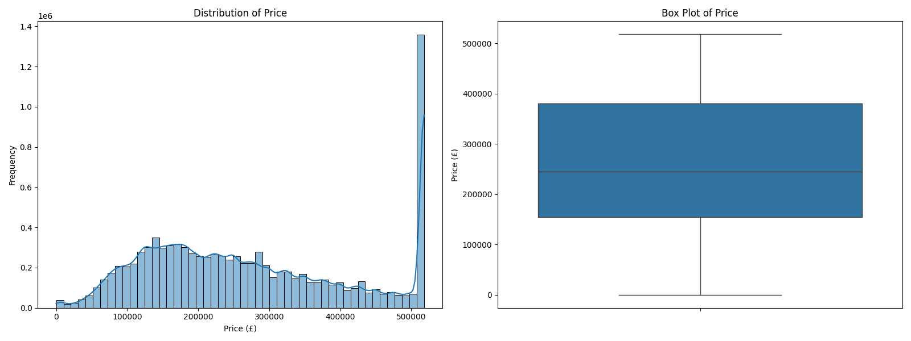
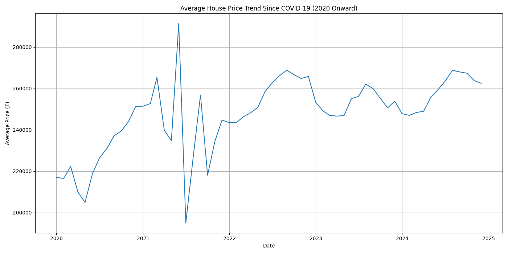
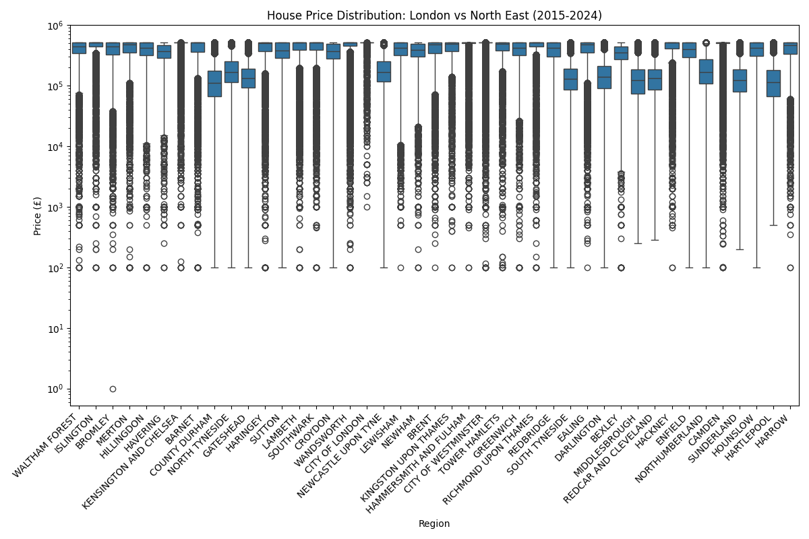
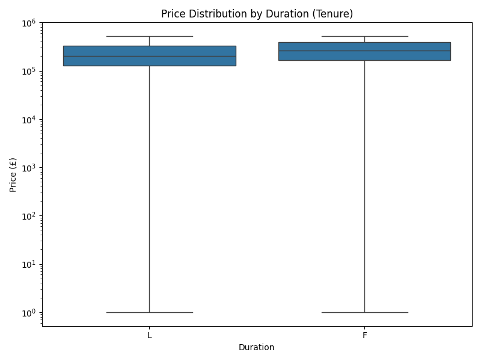

# Exploratory Data Analysis (EDA) Story: Unveiling UK House Price Dynamics

This report delves deeper into the insights gained from the Exploratory Data Analysis (EDA) of the UK house price data. We will explore the distributions of key variables, analyze the impact of COVID-19, and uncover regional price trends, all supported by the visualizations generated during the EDA phase.

## 1. Understanding the Data Landscape

Before diving into specific trends, it's crucial to understand the fundamental characteristics of our dataset. After efficient loading and filtering for the 2015-2024 period, we are working with over 10 million records, providing a robust foundation for our analysis.

### 1.1 Price Distribution

The distribution of house prices is a primary concern. As expected in real estate markets, the price distribution is heavily skewed towards lower values, with a long tail extending to very high-value properties. This indicates that while most properties fall within a certain price range, there are significant outliers at the higher end of the spectrum.

### 1.2 Property Types and Tenure

Understanding the types of properties sold and their tenure (freehold vs. leasehold) provides context for the market. Terraced (T), Semi-Detached (S), and Detached (D) houses are the most common property types, followed by Flats/Maisonettes (F) and 'Other' (O) categories. The majority of transactions are for Freehold (F) properties, which typically command different values than Leasehold (L) properties.

## 2. The Shadow of COVID-19: House Price Changes (2020 Onward)

The COVID-19 pandemic significantly impacted global economies, and the housing market was no exception. Our analysis specifically examines how house prices have evolved since 2020.

### 2.1 Average House Price Trend Since COVID-19

The monthly average house price trend since January 2020 reveals a dynamic market. We can observe initial fluctuations around the onset of the pandemic, followed by a general upward trajectory. This trend highlights the resilience and, in many cases, the acceleration of house price growth in the post-pandemic period, driven by factors such as increased demand for space, low interest rates, and government support schemes.

### 2.2 Price Distribution: Pre-COVID vs. Post-COVID

Comparing the price distribution before and after March 2020 (our defined start of the post-COVID period) provides a clearer picture of the shift. The box plot illustrates a noticeable increase in median house prices and a wider spread of prices in the post-COVID era, reinforcing the observation from the time-series trend.

## 3. Regional Disparities: London vs. North East

Location is paramount in real estate. We investigated regional price trends, specifically comparing high-value areas like London with more affordable regions like the North East of England.

### 3.1 Average House Price by County

Examining the average house prices across different counties reveals stark differences. Counties within London and the South East consistently show the highest average prices, reflecting economic concentration and demand in these areas.

### 3.2 House Price Distribution: London vs. North East

A direct comparison of price distributions between London (represented by 'GREATER LONDON' and other high-value London boroughs) and North East counties (Tyne and Wear, Durham, Northumberland) vividly illustrates the regional divide. London's prices are significantly higher, with a much broader range, indicating a luxury market at the top end.

### 3.3 Monthly Average House Price Trend: London vs. North East

Tracking the monthly average price trends for these regions over time further emphasizes their distinct trajectories. While both regions may experience general market movements, their absolute price levels and growth rates can differ substantially, reflecting local economic conditions and housing supply.

## 4. Relationships with Price: Key Drivers

Beyond geographical and temporal factors, property characteristics play a crucial role in determining price.

### 4.1 Price Distribution by Property Type

Detached properties generally command the highest prices, followed by Semi-Detached, Terraced, and Flats. 'Other' property types show a wide range, indicating their diverse nature.

### 4.2 Price Distribution by Old/New Property Status

New builds (`Y`) tend to have a higher median price and a tighter distribution compared to established dwellings (`N`), reflecting the premium associated with modern construction and amenities.

### 4.3 Price Distribution by Duration (Tenure)

Freehold properties (`F`) typically have higher prices than Leasehold properties (`L`), which is a common characteristic of the UK property market due to the nature of ownership rights.

### 4.4 Average House Price Trend by Year

The overall average house price has shown a consistent upward trend from 2015 to 2024, reflecting general market growth and inflation over the decade.

## 5. Conclusion from EDA

The Exploratory Data Analysis has provided a robust understanding of the UK housing market. We've confirmed the significant impact of the COVID-19 pandemic, highlighted pronounced regional disparities, and identified key property characteristics that drive price variations. These insights form a critical foundation for subsequent modeling efforts and policy recommendations.
