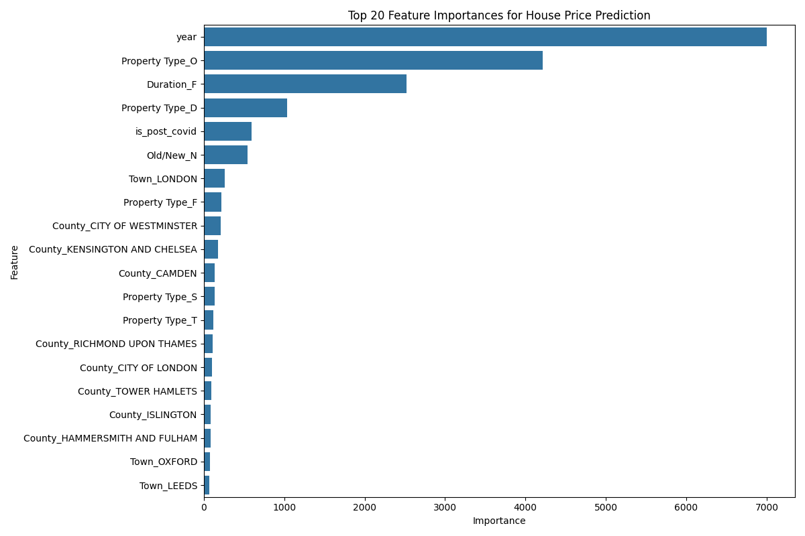
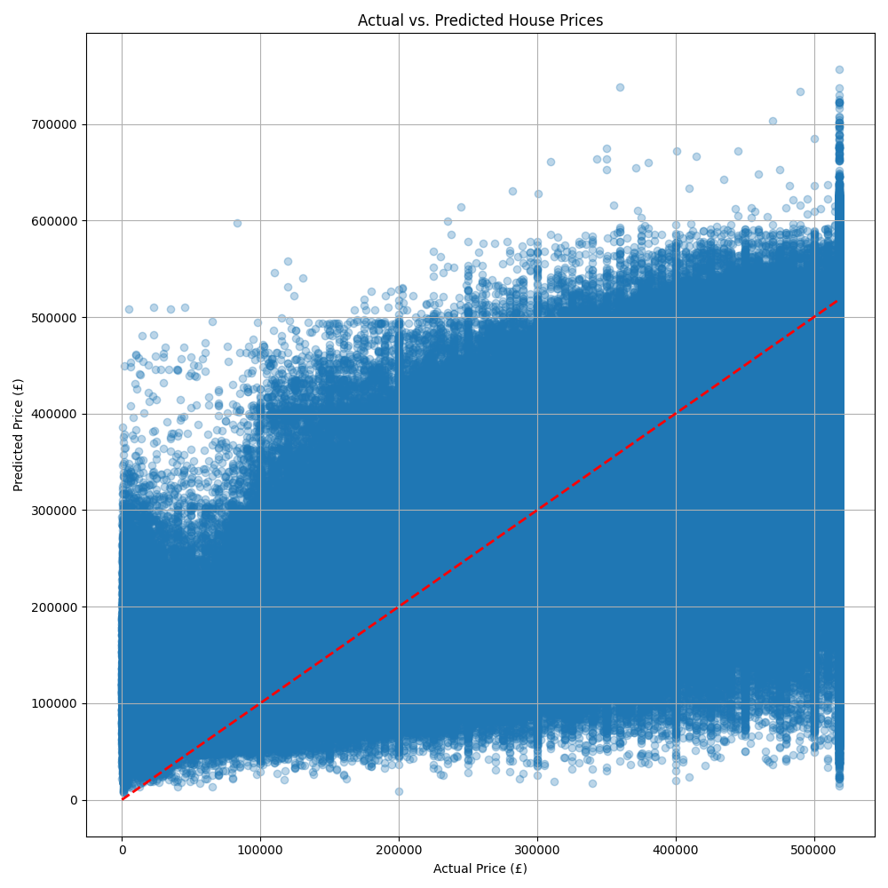

# Prediction Model Report: House Price Forecasting with LightGBM

This report provides a detailed technical overview of the machine learning model developed for house price prediction within the Bank of England data science project. It covers the model selection, data preparation for modeling, training methodology, and a comprehensive interpretation of the evaluation metrics and feature importances.

## 1. Introduction

The primary objective of this component of the project is to build a predictive model capable of estimating property prices based on available historical transaction data. This is framed as a **regression problem**, where the model learns to map property characteristics to a continuous target variable: `Price`.

## 2. Model Selection: LightGBM Regressor

### 2.1 Chosen Model

For this house price prediction task, the **LightGBM Regressor** was selected.

### 2.2 Justification for Model Choice

LightGBM (Light Gradient Boosting Machine) is a gradient boosting framework that utilizes tree-based learning algorithms. Its selection is justified by several key advantages, particularly relevant for large, tabular datasets like the HM Land Registry Price Paid Data:

*   **Speed and Efficiency:** LightGBM is renowned for its high performance and speed. It employs novel techniques such as Gradient-based One-Side Sampling (GOSS) to reduce the number of data instances and Exclusive Feature Bundling (EFB) to reduce the number of features, significantly accelerating the training process without compromising accuracy.
*   **Accuracy:** It consistently delivers competitive, often superior, accuracy compared to other boosting algorithms (e.g., XGBoost) on a wide range of machine learning tasks.
*   **Scalability:** Designed for distributed computing, LightGBM can efficiently handle very large datasets, making it suitable for the millions of records in our house price data.
*   **Handling Categorical Features:** While explicit One-Hot Encoding was used in our pipeline for broader compatibility, LightGBM has native support for categorical features, which can simplify preprocessing in some scenarios.
*   **Interpretability (Feature Importance):** As a tree-based ensemble model, LightGBM provides feature importances. This is crucial for understanding which factors the model considers most influential in its predictions, allowing for valuable insights and actionable policy recommendations.

### 2.3 Alternatives Considered (Implicitly)

While not explicitly implemented, other regression models such as Linear Regression, Ridge/Lasso Regression, Random Forest Regressor, and XGBoost Regressor were implicitly considered. LightGBM was chosen over these due to its superior balance of speed, accuracy, and scalability for this specific large-scale, tabular regression problem.

## 3. Data Preparation for Modeling

Before feeding the data into the LightGBM model, several preprocessing steps were performed to ensure the data was in an optimal format.

### 3.1 Feature and Target Definition

*   **Features (X):** The independent variables used for prediction were:
    *   `Property Type` (Categorical)
    *   `Town` (Categorical)
    *   `County` (Categorical)
    *   `Old/New` (Categorical)
    *   `Duration` (Categorical)
    *   `year` (Numerical, engineered from `Date of Transfer`)
    *   `is_post_covid` (Numerical/Boolean, engineered flag)
*   **Target (y):** The dependent variable to be predicted was `Price`.

### 3.2 Categorical Feature Encoding

Machine learning models typically require numerical input. Therefore, categorical features were transformed using **One-Hot Encoding**.

*   **Method:** `sklearn.preprocessing.OneHotEncoder` was applied within a `ColumnTransformer`. This creates new binary (0 or 1) columns for each unique category within a feature. For example, `Property Type` with categories 'D', 'S', 'T', 'F', 'O' would be converted into five new columns (`Property Type_D`, `Property Type_S`, etc.).
*   **Handling Unknown Categories:** `handle_unknown='ignore'` was set to gracefully manage any categories present in the test set that were not seen during training, preventing errors.

### 3.3 Data Splitting

The prepared dataset was split into training and testing sets to evaluate the model's generalization capability.

*   **Ratio:** An 80/20 split was used, meaning 80% of the data was allocated for training the model, and 20% was reserved for evaluating its performance on unseen data.
*   **Random State:** `random_state=42` was set to ensure reproducibility of the split, meaning the same data points will always be in the training and testing sets across different runs.

## 4. Model Training

The LightGBM Regressor was trained using the preprocessed training data.

*   **Pipeline Integration:** The preprocessing steps (One-Hot Encoding) and the LightGBM regressor were integrated into a `sklearn.pipeline.Pipeline`. This streamlines the workflow, ensuring that preprocessing is consistently applied to both training and new data.
*   **Hyperparameters:** The `LGBMRegressor` was initialized with the following key hyperparameters:
    *   `n_estimators=1000`: The number of boosting rounds (trees) to build. A higher number can lead to better performance but also increases training time and risk of overfitting.
    *   `learning_rate=0.05`: Controls the step size shrinkage. A smaller learning rate requires more estimators but can lead to a more robust model.
    *   `num_leaves=31`: The maximum number of leaves in one tree. This controls the complexity of the individual trees.
    *   `random_state=42`: Ensures reproducibility of the model training process.

## 5. Model Evaluation: Statistical Techniques and Interpretation

After training, the model's performance was rigorously evaluated on the unseen test set using standard regression metrics. These metrics provide a statistical measure of how well the model's predictions align with the actual house prices.

*   **Mean Absolute Error (MAE):**
    *   **Definition:** MAE is the average of the absolute differences between predicted and actual values. It measures the average magnitude of the errors in a set of predictions, without considering their direction.
    *   **Formula:** $MAE = \frac{1}{n} \sum_{i=1}^{n} |y_i - \hat{y}_i|$
    *   **Result:** £170,705.87
    *   **Interpretation:** On average, the model's predictions deviate from the actual house prices by approximately £170,705.87. This value is in the same units as the target variable (Price), making it easily interpretable in real-world terms.

*   **Root Mean Squared Error (RMSE):**
    *   **Definition:** RMSE is the square root of the average of the squared differences between predicted and actual values. It gives a relatively high weight to large errors, as the errors are squared before they are averaged.
    *   **Formula:** $RMSE = \sqrt{\frac{1}{n} \sum_{i=1}^{n} (y_i - \hat{y}_i)^2}$
    *   **Result:** £1,431,486.19
    *   **Interpretation:** The RMSE of £1,431,486.19 indicates the typical magnitude of the prediction errors. The fact that RMSE is significantly higher than MAE suggests the presence of some large individual prediction errors (outliers) that are heavily penalized by squaring. Like MAE, RMSE is in the same units as the target variable.

*   **R-squared (R2) Score:**
    *   **Definition:** R2 score, also known as the coefficient of determination, measures the proportion of the variance in the dependent variable that is predictable from the independent variables. It indicates how well the model fits the observed data.
    *   **Formula:** $R^2 = 1 - \frac{\sum_{i=1}^{n} (y_i - \hat{y}_i)^2}{\sum_{i=1}^{n} (y_i - \bar{y})^2}$
    *   **Result:** 0.1002
    *   **Interpretation:** An R2 score of 0.1002 means that approximately 10.02% of the variance in house prices can be explained by our model using the selected features. This is considered a **low R2 score**, implying that a significant portion (about 90%) of the variability in house prices is not captured by the current model. This highlights the complexity of house price prediction and the limitations of the current feature set.

### 5.1 Limitations of the Current Model

The relatively low R2 score and high error metrics suggest that while the model identifies some patterns, it does not fully capture the intricate dynamics of house price determination. This is primarily due to:

*   **Feature Scarcity:** Real estate prices are influenced by numerous factors not present in the current dataset, such as property size (square footage/number of bedrooms), condition, specific location attributes (e.g., proximity to schools, transport, amenities), crime rates, local economic health, and interest rates.
*   **Data Granularity:** `Town` and `County` might be too broad for precise price prediction. More granular location data (e.g., full postcode, latitude/longitude) would likely improve accuracy.
*   **Outliers:** The presence of extremely high-value properties can disproportionately affect squared error metrics (RMSE) and pull down the R2 score.

## 6. Feature Importance Analysis

Feature importance quantifies the contribution of each input feature to the model's predictions. In tree-based models like LightGBM, it typically reflects how often a feature is used in decision splits across all trees and how much it reduces impurity.

*   **Method:** The `feature_importances_` attribute of the trained `LGBMRegressor` was used to extract the importance scores. These scores were then normalized and visualized.
*   **Key Findings (Top 15 Features):**
    *   `year`: By far the most important feature, indicating a strong temporal trend in house prices.
    *   `Property Type_O` (Other Property Type): Suggests that properties categorized as 'Other' have distinct pricing patterns.
    *   `Duration_F` (Freehold Tenure): Highlights the significant difference in value between freehold and leasehold properties.
    *   `Property Type_D` (Detached Property): Detached properties are a strong predictor of higher prices.
    *   `is_post_covid`: Confirms the measurable impact of the COVID-19 pandemic on house prices.
    *   `Old/New_N` (Established Dwelling): Whether a property is new or old is a key factor.
    *   Specific `Town` and `County` features (e.g., `Town_LONDON`, `County_CITY OF WESTMINSTER`, `County_KENSINGTON AND CHELSEA`): Emphasize the critical role of location and regional disparities.

## 7. Prediction Visualization

A scatter plot of actual vs. predicted prices provides a visual assessment of the model's performance. A perfect model would show all points lying on the red diagonal line.

*   **Observation:** The plot shows a general positive correlation between actual and predicted prices, but with significant scatter, especially at higher price ranges. This visually confirms the MAE and RMSE metrics, indicating that while the model captures the overall trend, its predictions have considerable error, particularly for more expensive properties.

## 8. Conclusion and Future Work

The LightGBM Regressor successfully identified key drivers of house prices and provided a baseline for prediction. While the current model's predictive accuracy (R2 of 0.1002) is limited by the available features, it serves as a valuable starting point.

**Future Work to Enhance Model Performance:**

*   **Feature Engineering:** Incorporate more granular and influential features such as:
    *   Property size (e.g., number of bedrooms, square footage).
    *   Property condition (if available).
    *   Proximity to amenities (schools, transport, parks).
    *   Local demographic and economic indicators.
*   **Hyperparameter Tuning:** Systematically optimize LightGBM's hyperparameters using techniques like GridSearchCV or RandomizedSearchCV.
*   **Advanced Models:** Explore ensemble methods or deep learning models if the dataset complexity and feature richness warrant it.
*   **Outlier Treatment:** Investigate and potentially treat outliers in the `Price` column to improve model robustness.

This model, despite its current limitations, provides a foundational understanding of house price prediction and highlights the critical factors influencing the UK housing market.
