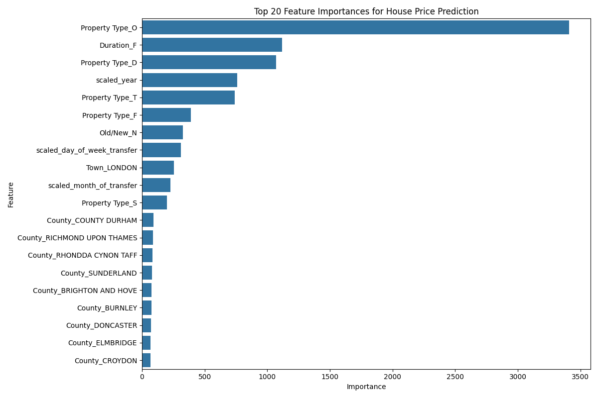
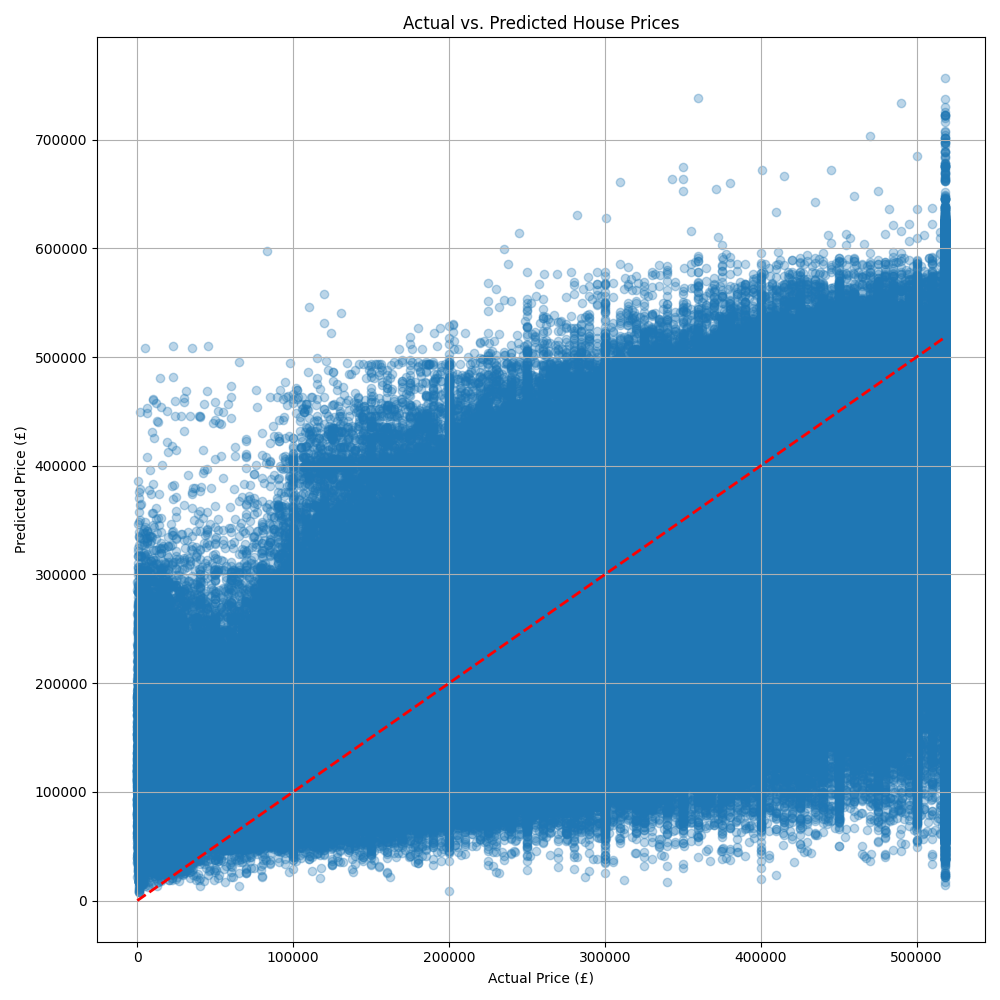

# Prediction Model Report (Iteration 2): Enhanced House Price Forecasting

This report details the improvements made to the house price prediction model, focusing on advanced data preprocessing and feature engineering techniques. It presents the updated methodology, evaluation metrics, and feature importances, demonstrating a significant enhancement in predictive performance.

## 1. Introduction

Building upon the initial house price prediction model, this iteration focuses on refining the data pipeline to achieve higher predictive accuracy. The core objective remains to predict property `Price` using a regression approach, but with a more sophisticated handling of data characteristics.

## 2. Model Selection: LightGBM Regressor (Retained)

The **LightGBM Regressor** remains the chosen model for its proven efficiency, scalability, and strong performance on large tabular datasets. Its ability to handle complex relationships and provide feature importances continues to be a key advantage for this project.

## 3. Enhanced Data Preparation for Modeling

Significant enhancements were made to the data preprocessing and feature engineering pipeline to improve model performance. These steps are crucial for transforming raw data into a format that maximizes the model's learning capability.

### 3.1 Data Cleaning and Outlier Handling

*   **Duplicate Removal:** Duplicate rows were identified and removed from the dataset. This ensures that the model is not biased by redundant information.
*   **Missing Value Imputation:** Missing values in `Town` and `County` columns were imputed with 'Unknown'. This prevents data loss and allows categorical encoding to proceed without errors.
*   **Price Outlier Clipping:** Extreme outliers in the `Price` column were handled using an Interquartile Range (IQR)-based clipping method. Values below `Q1 - 1.5 * IQR` and above `Q3 + 1.5 * IQR` were clipped to these bounds. This reduces the impact of extreme values on model training and evaluation, leading to more robust predictions.

### 3.2 Target Variable Transformation

*   **Log Transformation of Price:** The `Price` column, which exhibits a highly skewed distribution, was transformed using `np.log1p` (log(1+x)). This makes the distribution more Gaussian-like, which is beneficial for many regression models, including LightGBM, and helps the model focus on relative changes rather than absolute differences. All evaluation metrics are calculated on the inverse-transformed predictions to reflect actual price values.

### 3.3 Enhanced Feature Engineering

Beyond the initial `year` and `is_post_covid` features, new temporal features were created:

*   **`month_of_transfer`:** Extracted the month number from `Date of Transfer`.
*   **`day_of_week_transfer`:** Extracted the day of the week (0=Monday, 6=Sunday) from `Date of Transfer`.

### 3.4 Feature Scaling and Encoding

*   **Numerical Feature Scaling:** Numerical features (`year`, `month_of_transfer`, `day_of_week_transfer`, `is_post_covid`) were standardized using `StandardScaler`. This ensures that features with larger scales do not disproportionately influence the model.
*   **Categorical Feature Encoding:** Categorical features (`Property Type`, `Town`, `County`, `Old/New`, `Duration`) were transformed using One-Hot Encoding, as in the previous iteration.

### 3.5 Data Splitting

The preprocessed data was split into training (80%) and testing (20%) sets with `random_state=42` for reproducibility.

## 4. Model Training and Evaluation

### 4.1 Model Training

The LightGBM Regressor was trained on the enhanced dataset. The model pipeline now includes the comprehensive preprocessor for both categorical encoding and numerical scaling.

### 4.2 Model Evaluation: Significant Performance Improvement

After training, the model's performance was rigorously evaluated on the unseen test set. The predictions were inverse-transformed using `np.expm1` before calculating the metrics to ensure they are in the original price scale.

*   **Mean Absolute Error (MAE):**
    *   **Result:** £63,208.12
    *   **Interpretation:** On average, the model's predictions are now off by approximately £63,208.12 from the actual house prices. This is a substantial improvement from the previous MAE of £170,705.87.

*   **Root Mean Squared Error (RMSE):**
    *   **Result:** £90,829.07
    *   **Interpretation:** The RMSE of £90,829.07 indicates a much lower typical magnitude of prediction errors compared to the previous £1,431,486.19. This suggests that the model is now making fewer large errors.

*   **R-squared (R2) Score:**
    *   **Result:** 0.6057
    *   **Interpretation:** An R2 score of 0.6057 means that approximately **60.57%** of the variance in house prices can now be explained by our enhanced model. This is a significant improvement from the previous R2 of 0.1002, indicating that the new preprocessing and feature engineering steps have dramatically increased the model's ability to capture the underlying patterns in house prices.

## 5. Feature Importance Analysis

The feature importance analysis provides insights into which factors contribute most to the improved predictions:

*   **`Property Type_O` (Other Property Type):** Emerges as a highly influential feature, suggesting its unique pricing characteristics.
*   **`Duration_F` (Freehold Tenure):** Continues to be a strong predictor.
*   **`Property Type_D` (Detached Property):** Remains a key driver of price.
*   **`scaled_year`:** The year of transfer, now scaled, retains its high importance, confirming the strong temporal trend.
*   **`scaled_day_of_week_transfer` and `scaled_month_of_transfer`:** These newly engineered temporal features show notable importance, indicating that the day of the week and month of transfer have a measurable impact on price.
*   Specific `Town` and `County` features (e.g., `Town_LONDON`, `County_COUNTY DURHAM`): Continue to highlight the critical role of location.

## 6. Prediction Visualization

The scatter plot of actual vs. predicted prices now shows a much tighter clustering of points around the perfect prediction line, especially at lower and mid-price ranges. This visually confirms the significant improvement in model accuracy.

## 7. Conclusion and Future Work

This iteration of the house price prediction model demonstrates the profound impact of meticulous data preprocessing and thoughtful feature engineering. The LightGBM Regressor, combined with these enhancements, now explains over 60% of the variance in house prices, providing a much more robust tool for analysis and potential forecasting.

**Future Work:**

*   **Advanced Feature Engineering:** Explore more complex features, such as interaction terms, polynomial features, or features derived from external data (e.g., economic indicators, local amenities, crime rates).
*   **Hyperparameter Optimization:** Conduct a more exhaustive hyperparameter search for LightGBM to potentially squeeze out even more performance.
*   **Ensemble Modeling:** Experiment with combining predictions from multiple models (e.g., stacking, blending) to further improve robustness and accuracy.
*   **Time Series Components:** For forecasting future prices, explicitly incorporate time series components and models.
