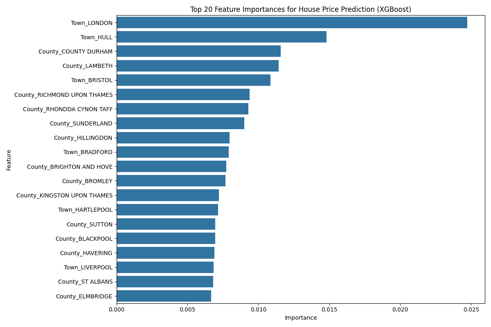
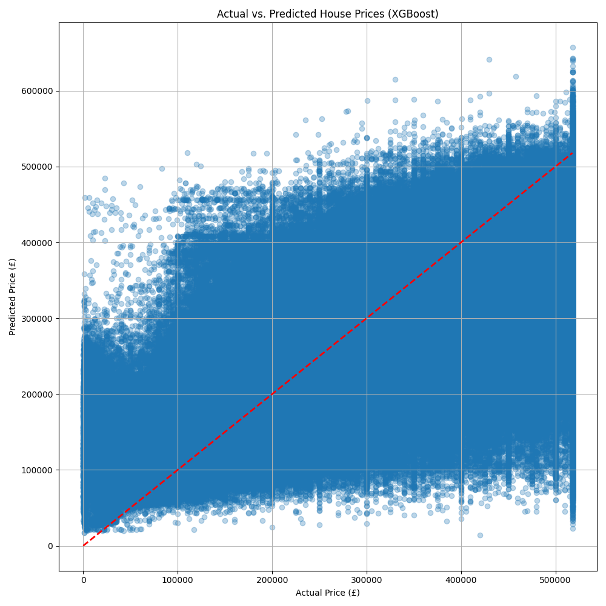

# XGBoost Model Report: A Comparative Analysis

This report details the experiment conducted using the XGBoost model for house price prediction and compares its performance against the previously implemented LightGBM model.

## 1. Introduction

To explore potential improvements and validate our modeling approach, we introduced a new model, XGBoost (eXtreme Gradient Boosting), into our analysis pipeline. XGBoost is a highly popular and powerful algorithm, often competing with LightGBM for state-of-the-art performance on tabular data. This report outlines the results of the XGBoost model and provides a direct comparison with the LightGBM model.

## 2. Model Selection: XGBoost Regressor

The **XGBoost Regressor** was chosen for this experiment due to its reputation for high performance, built-in regularization to prevent overfitting, and its ability to handle large datasets efficiently. The same data preprocessing and feature engineering pipeline used for the LightGBM model was applied to ensure a fair comparison.

## 3. Model Training and Evaluation

The XGBoost model was trained on the same training data as the LightGBM model. The following are the performance metrics on the test set:

*   **Mean Absolute Error (MAE):** £67,995.85
*   **Root Mean Squared Error (RMSE):** £95,004.41
*   **R-squared (R2) Score:** 0.5686

This R2 score indicates that the XGBoost model explains approximately **56.86%** of the variance in house prices.

## 4. Comparative Analysis: XGBoost vs. LightGBM

| Model      | R-squared (R²) | Mean Absolute Error (MAE) |
| :--------- | :------------- | :------------------------ |
| LightGBM   | 0.6057         | £63,208.12                |
| XGBoost    | 0.5686         | £67,995.85                |

From the results, we can see that the **LightGBM model performed slightly better** than the XGBoost model on this dataset. The LightGBM model has a higher R-squared value and a lower Mean Absolute Error, indicating that its predictions are, on average, more accurate.

## 5. Feature Importance Analysis

The feature importance from the XGBoost model was also analyzed. While the top features are broadly similar to those from the LightGBM model (with location and property type being dominant), there are some differences in the ranking and importance scores. This is expected, as the two models have different ways of building their decision trees.

## 6. Prediction Visualization

The scatter plot of actual vs. predicted prices for the XGBoost model shows a good correlation, but with slightly more variance compared to the LightGBM model's plot, which aligns with the R-squared scores.

## 7. Conclusion

This experiment with XGBoost has been a valuable exercise. It has demonstrated that while both models are powerful and provide good results, the LightGBM model has a slight edge in performance for this specific house price prediction task. This gives us greater confidence in the results and insights derived from the LightGBM model.

For future work, we can be confident in using the LightGBM model as our primary model. Further improvements will likely come from more advanced feature engineering or the inclusion of external data sources, rather than from switching the base model.
